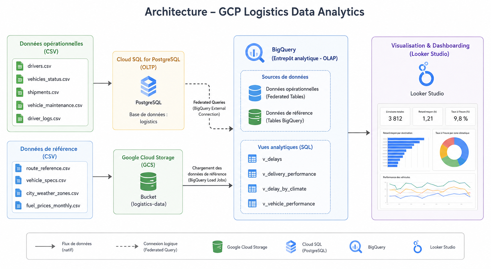

# GCP Logistics Data Analytics

## Présentation

Ce projet met en œuvre une architecture Data Analytics de bout en bout sur Google Cloud Platform.

L'objectif est de comprendre comment combiner un système transactionnel (PostgreSQL sur Cloud SQL) et un entrepôt de données analytique (BigQuery) afin de produire des indicateurs métiers visualisés dans Looker Studio.

Ce projet m'a notamment permis d'approfondir les notions de systèmes **OLTP** et **OLAP**, les **Federated Queries**, ainsi que la construction d'une chaîne analytique complète sur GCP.

---

## Architecture

## Architecture

<p align="center">
  
</p>

Cette architecture sépare les données opérationnelles, stockées dans PostgreSQL sur Cloud SQL, des données de référence stockées dans Google Cloud Storage.

Les données sont ensuite centralisées dans BigQuery afin de créer des vues analytiques et d’alimenter les tableaux de bord Looker Studio.

---

## Objectifs du projet

- Déployer une base PostgreSQL sur Cloud SQL
- Charger des données opérationnelles dans PostgreSQL
- Charger des données de référence dans Google Cloud Storage
- Centraliser l'ensemble des données dans BigQuery
- Utiliser les Federated Queries entre Cloud SQL et BigQuery
- Construire des vues analytiques SQL
- Réaliser des tableaux de bord avec Looker Studio
- Comprendre le rôle des architectures OLTP et OLAP

---

## Technologies utilisées

- Google Cloud Platform
- Google Cloud Storage
- Cloud SQL
- PostgreSQL
- BigQuery
- Federated Queries
- SQL
- Looker Studio
- Google Cloud CLI

---

## Architecture OLTP / OLAP

L'architecture repose sur deux systèmes complémentaires.

### PostgreSQL (Cloud SQL)

PostgreSQL constitue la couche transactionnelle (OLTP).

Les données opérationnelles suivantes y sont stockées :

- conducteurs ;
- statut des véhicules ;
- expéditions ;
- opérations de maintenance ;
- journaux de conduite.

### BigQuery

BigQuery constitue la couche analytique (OLAP).

Les données provenant de PostgreSQL et de Google Cloud Storage y sont centralisées afin de réaliser les jointures, les agrégations, les analyses métier et l'alimentation des tableaux de bord.

---

## Sources de données

### Données opérationnelles (Cloud SQL)

Les fichiers suivants ont été importés dans la base PostgreSQL `logistics` :

- `drivers.csv`
- `vehicles_status.csv`
- `shipments.csv`
- `vehicle_maintenance.csv`
- `driver_logs.csv`

Les tables ont été créées dans Cloud SQL Studio à partir du schéma PostgreSQL disponible dans ce dépôt.

Les fichiers CSV ont ensuite été importés via la fonctionnalité **Import data** de Cloud SQL Studio.

### Données de référence (Google Cloud Storage)

Les fichiers suivants ont été stockés dans Google Cloud Storage puis chargés dans BigQuery :

- `route_reference.csv`
- `vehicle_specs.csv`
- `city_weather_zones.csv`
- `fuel_prices_monthly.csv`

---

## Vues analytiques

Le projet s'appuie sur quatre vues SQL développées dans BigQuery.

### `v_delays`

Calcule le retard de chaque livraison en comparant la durée réelle à la durée théorique de l'itinéraire.

### `v_delivery_performance`

Analyse les performances logistiques par ville de destination et par zone climatique :

- nombre de trajets ;
- retard moyen ;
- taux de livraisons à l'heure.

### `v_delay_by_climate`

Compare les retards moyens ainsi que les taux de ponctualité selon les différentes zones climatiques.

### `v_vehicle_performance`

Compare les performances des différents types de véhicules selon plusieurs indicateurs :

- nombre de trajets ;
- retard moyen ;
- retard moyen par trajet ;
- taux de livraisons à l'heure ;
- vitesse moyenne.

---

## Quelques résultats obtenus

Les observations suivantes concernent uniquement le jeu de données utilisé dans ce projet.

### Performance des livraisons

- Paris présente le retard moyen le plus élevé (**1,69 h**).
- Madrid (**1,64 h**) et Londres (**1,62 h**) suivent de près.
- Marseille présente le meilleur taux de livraisons à l'heure (**23,7 %**) parmi les villes analysées.

### Influence des zones climatiques

- Les destinations situées en zone **Temperate** présentent le retard moyen le plus important (**1,52 h**).
- Les zones **Alpine** affichent le retard moyen le plus faible (**0,75 h**) ainsi que le meilleur taux de ponctualité (**13 %**).

Ces résultats mettent en évidence une association entre certaines zones climatiques et les performances logistiques observées sur ce jeu de données. Ils ne permettent pas d'établir une relation de causalité.

### Performance des véhicules

- Les **Van L2H2 Diesel** obtiennent le meilleur taux de livraisons à l'heure (**11,2 %**).
- Les **Rigid 12t Diesel** arrivent juste derrière (**11,0 %**).
- Les **Van Electric** présentent un taux de ponctualité de **8,3 %** sur ce jeu de données.

---

## Structure du dépôt

```text
gcp-logistics-data-analytics/
│
├── cloud-sql/
│   ├── 01_create_instance.md
│   ├── 02_create_database_and_user.md
│   ├── 03_postgres_schema.sql
│   └── 04_import_data.md
│
├── bigquery/
│   ├── 01_federated_queries.sql
│   ├── reference_tables_schema.md
│   └── views/
│       ├── v_delays.sql
│       ├── v_delay_by_climate.sql
│       ├── v_delivery_performance.sql
│       └── v_vehicle_performance.sql
│
├── dashboard/
│   └── README.md
│
└── README.md
```

---

## Pistes d'amélioration

- automatiser l'ingestion des données ;
- mettre en place une synchronisation planifiée entre Cloud SQL et BigQuery ;
- intégrer des contrôles de qualité des données ;
- industrialiser l'infrastructure avec Terraform ;
- ajouter une couche de transformation avec dbt ;
- enrichir les tableaux de bord avec de nouveaux indicateurs métiers.

---

## Évolutions

Les principaux scripts SQL ainsi que la documentation du projet sont disponibles dans ce dépôt.

Les captures des tableaux de bord Looker Studio seront ajoutées prochainement.
